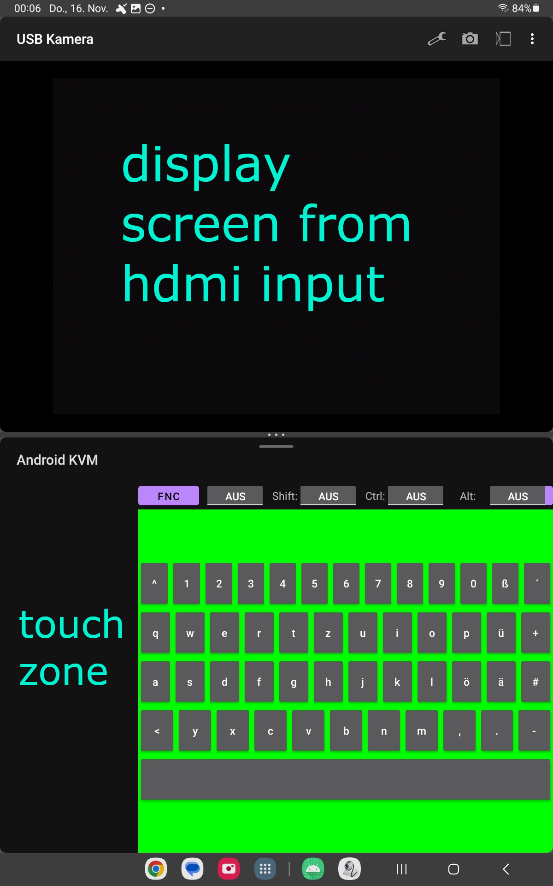

basic idea is a kvm switch using

1. keyboard and mouse input coming from
   - https://github.com/inputstick/InputStickAPI-Android
   - http://inputstick.com/
2. your run of the mill usb-c video capture card 
   in my case i bought the B0C2CJPV8D ( https://www.amazon.com/Newhope-Capture-Streaming-Teaching-Conference/dp/B0C2CJPV8D ) capture card a few weeks ago 
   ⚠️ TODO: camera integration (i did find working usb camera apps so its definitely possible https://play.google.com/store/apps/details?id=infinitegra.app.usbcamera&hl=de&gl=US) 
   ⚠️probably not gonna do that anytime soon tho since i can just use the app in split screen with the inputstick app , consderation: its probably neat to have touch screen emulation 

   see below:
   screaming green background is currently for connection visualisation ^^

